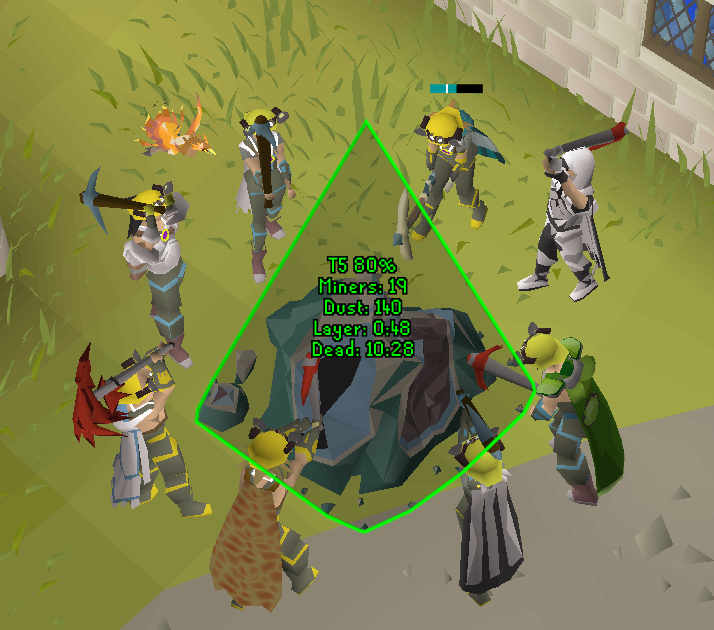

# Shooting Star Info
Displays various info about shooting stars that you find/mine such as tier, xp/hr, stardust/hr, health %, time till next layer, time till death.

### Toggleable Features:
- Displays number of players actively mining the star
- Displays Tier of the star
- Displays % of the current tier left
- Displays Info Box of star information as soon as a star is in view
- Displays Hint arrow pointing towards nearby stars if in view
- Displays star dust per hour
- Highlight stars in green if you can mine them and in red if you can't
- Add a copy option on stars to copy their information to be pasted into discord. For example, W386 T3 66% - 8 Miners - Brimhaven south dungeon entrance 3 minutes ago
- Estimate time to next layer
- Estimate time till star dies
- Add found stars to game chat
- Hide Health Bar
- Configure Health Bar width
- Configure Health Bar height
- Configure Health Bar colors

### Credits
Originally based on Cute Rock's [Star Tier Indicator](https://github.com/zodaz/StarTierIndicator/tree/c270a68ba8a1a4307670bdc95c8cce903a1e1744) plugin.
Some code used from Cute Rock's [Star Calling Assist](https://runelite.net/plugin-hub/show/star-calling-assist) plugin.
